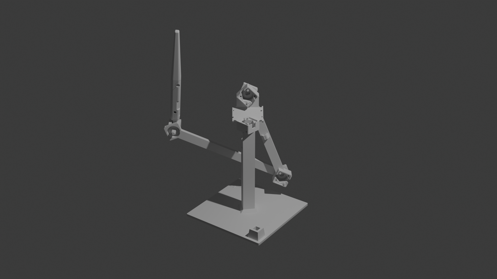

# Mobi3-Pen
The Mobi3-Pen was designed to be as simple as possible, using hardware that makers should already have. It utilizes 3 rotation sensors to determine the end point of the pen and features a usable area of roughly 1 cubic foot, allowing your drawings to enter a third dimension of perspective mistakes!

The pen clasifies itself as a custom HID device, meaning that you'll need to program in device support to any software you wish to use it with. Check out [Mobi3-Pen-HIDReader](https://github.com/twu425/Mobi3-Pen-HIDReader) for an example using python. 

*Still a work in progress, build instructions will be added soon-ish!*

## Tools Required:
- Soldering Iron and Solder 
  - This was my third soldering project. Most of the soldering is pretty simple. Make sure your solder joints are strong, as the wires will put some stress on them.
- 3D Printer and Filament 
  - Use a highly rigid filament like PLA to minimize innacuracy due to bending of arms. 

## Build of Materials:
| Part  | Quantity | Source | Notes |
| -------------- | ------------- | -------------- | ------------- |
| Pi Pico | 1 | [Raspberry Pi Vendor](https://www.raspberrypi.com/products/raspberry-pi-pico) | Any Pi Pico (H, W, 2) should work. |
| Silicone Tinned Copper Wire, 30AWG | A few meters | Amazon, Walmart, Adafruit | You can use any wire, but it needs to be flexible. Higher AWG number = thinner, more flexible. Silicone is more flexible than plastic. |
| 608 Ball Bearing | 3 | Amazon, Bike Shops  |  |
| Microswitch | 3 | Amazon, Salvaged from old mice | The kind used in mice. Remove the switch arms if they have them. |
| A5400 Sensor Breakout Board w/ Magnet | 3 | [Amazon](https://a.co/d/0WISSSe) | **Ensure magnets are 5mmx2mm and diametrically magnetized.** |
| M3x6mm Screw | 8 | Amazon, Hardware Stores | |
| Micro-Usb Cable | 1 | Pretty much anywhere| A long, flexible one is preferred but not required. |

Models are made in the open-source FreeCad (get it here: https://www.freecad.org/) and the CAD file is included in this repository if you wish the modify the design.

## Related Repositories:
| Repository     | Link    |
| -------------- | ------------- |
| Build Guide    | *You are here!* |
| Firmware       | [Mobi3-Pen-CircuitPython](https://github.com/twu425/Mobi3-Pen-CircuitPython)  |
| Overlay        | [Mobi3-Pen-Overlay](https://github.com/twu425/Mobi3-Pen-Overlay)  |
| Blender Addon  | [Mobi3-Pen-BlenderAddon](https://github.com/twu425/Mobi3-Pen-BlenderAddon)  |
| HID Reading Example  | [Mobi3-Pen-HIDReader](https://github.com/twu425/Mobi3-Pen-HIDReader)  |

